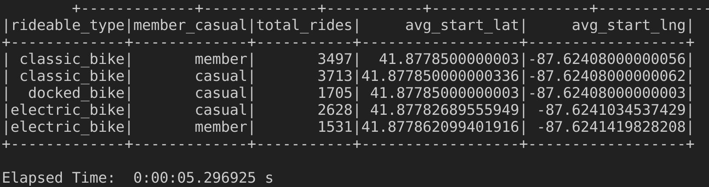
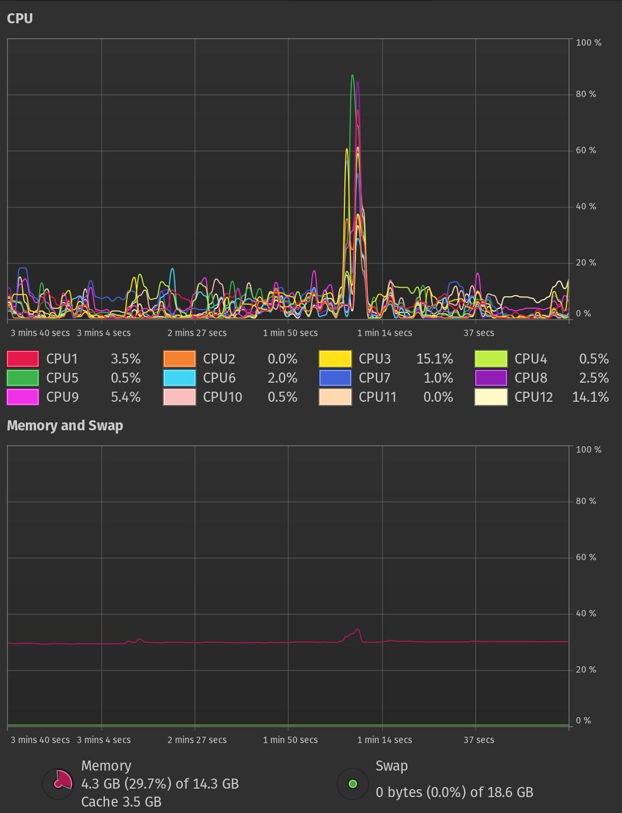
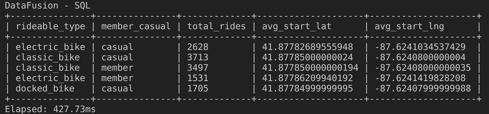
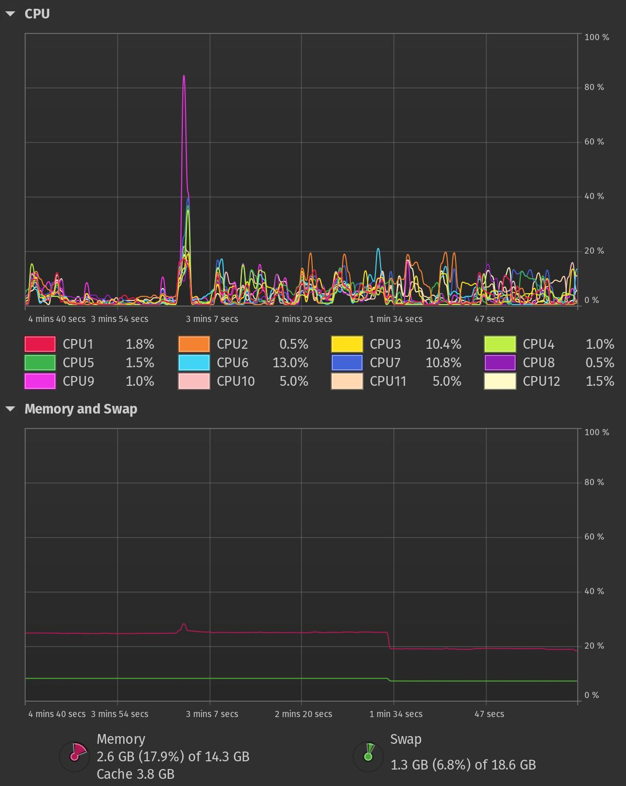
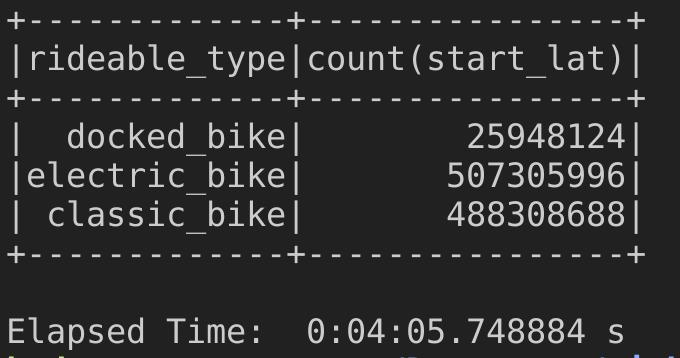
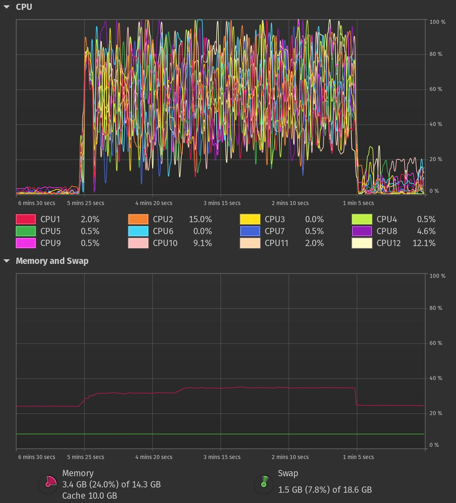
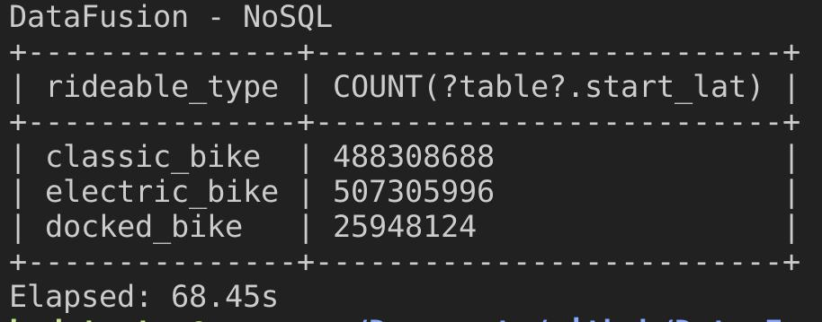
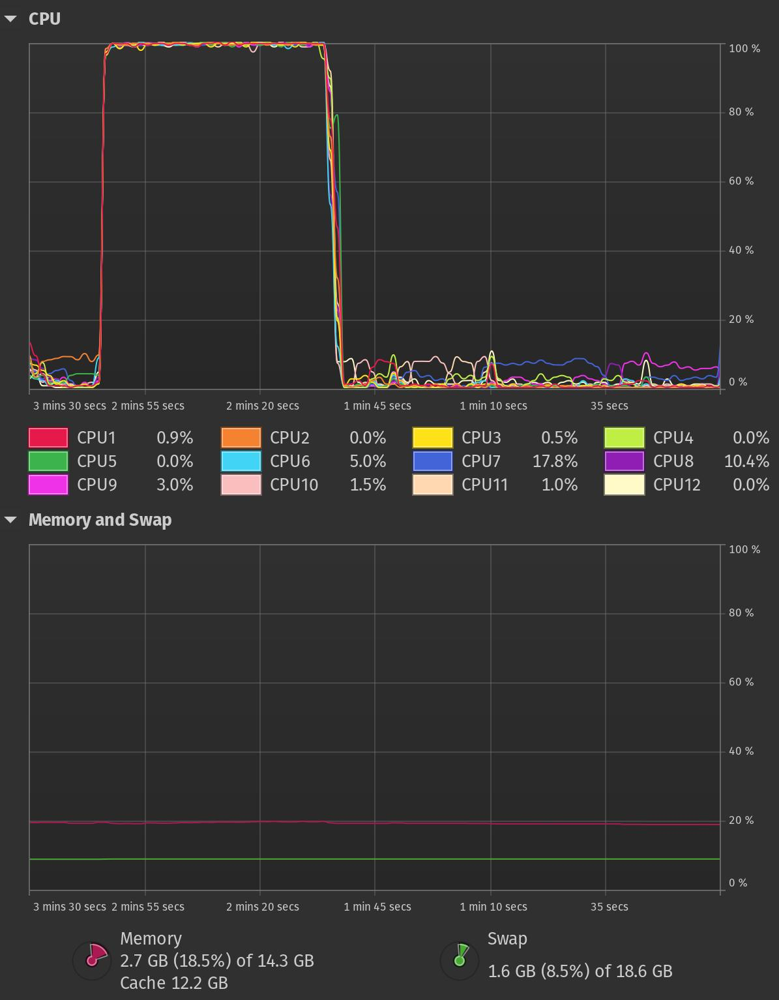

### Datafusion vs PySpark: performance comparison and thoughts
Can Rust's DataFusion challenge Spark's dominance in data engineering? DataFusion's recent performance improvements are intriguing.

#### Datafusion & Spark
DataFusion is a fast query engine for Rust that uses Apache Arrow for speedy data analysis. It supports common data formats and offers customization for specific needs, with a strong community for support.

[Datafusion docs](https://arrow.apache.org/datafusion/user-guide/introduction.html)

Apache Spark: Open-source big data engine for handling massive datasets across clusters, making it a popular choice.

[Spark docs](https://spark.apache.org/docs/latest/)

#### Comparison
Feature | Apache DataFusion (Rust) | Apache Spark |
--- | --- | --- |
Processing Model | Single-node, in-memory | Distributed, in-memory and out-of-memory |
Language | Rust | Scala (primary), Java, Python, R |
Scalability | Limited but on roadmap (can be distributed with Ballista) | Highly scalable |
Supported Data Sources | CSV, Parquet, AVRO, JSON | Wide variety including CSV, Parquet, JSON, JDBC, and more |
Performance | Faster? | Slower? |
Ease of Use | Simpler API, easier to learn | More complex API with a larger learning curve |
Ecosystem | Smaller, growing ecosystem | Large, mature ecosystem with a wide range of libraries and tools
Maturity | Relatively new project (~5 years)| Established and widely used |
Use Cases | Large scale analytics, prototyping, embedded analytics | Large-scale data processing, machine learning, real-time analytics |


### So... Which is faster? 1.1 GB dataset
##### System:
AMD® Ryzen 5 6600hs creator edition × 12
16.0 GiB
Pop!_OS 22.04 LTS


##### Dataset: [ciclistic-trip-data](https://www.kaggle.com/datasets/chihchungwuo/cyclistic-trip-data) (12 csv files, 19 - 153 MB each, total 1.1 GB)


#### Test 1: Group by & count with functions
Find out how many cyclists in each class was.

###### PySpark
took almost 6 seconds to get count's by bike type.

<div align="center">
  
</div>

<div align="center">
  
</div>


###### Datafusion
took almost 313 ms which is faster 19x faster than PySpark!

<div align="center">
  
</div>

<div align="center">
  
</div>

#### Test 2: Group by, filter, calculations using SQL

Use SQL and little more calculations:
```
select 
  rideable_type,
  member_casual,
  count(ride_id) as total_rides,
  avg(start_lat) as avg_start_lat,
  avg(start_lng) as avg_start_lng
from rides
where start_station_name = 'Michigan Ave & Jackson Blvd'
group by rideable_type, member_casual
```

###### PySpark
Took also almost 6 seconds, the same as previous.

<div align="center">
  
</div>

<div align="center">
  
</div>

###### Datafusion
Took 427 ms which is again xx times faster than PySpark.

<div align="center">
  
</div>

<div align="center">
  
</div>

### ok... Multiply our dataset up to 10 billion rows!
I multiplied main dataset 350 times and it increased to 4200 files and total 192 GB size.


###### PySpark
#### Test 3: Group by & count with functions (10 bill rows)

PySpark took 4 min. 5 seconds to calculate.

<div align="center">
  
</div>

<div align="center">
  
</div>

###### Datafusion

Rust based Datafusion took 68 seconds which is 3.8x times faster.

<div align="center">
  
</div>

<div align="center">
  
</div>


#### Test 4: Group by, filter, calculations using SQL(10 bill rows)

###### PySpark
PySpark completed this challenge in 4 min. 8 seconds.
<div align="center">
  
</div>

<div align="center">
  
</div>

###### Datafusion
Completed it in 1 min. 31 second which is again faster than PySpark by 2.7x times

<div align="center">
  
</div>

System:
<div align="center">
  
</div>