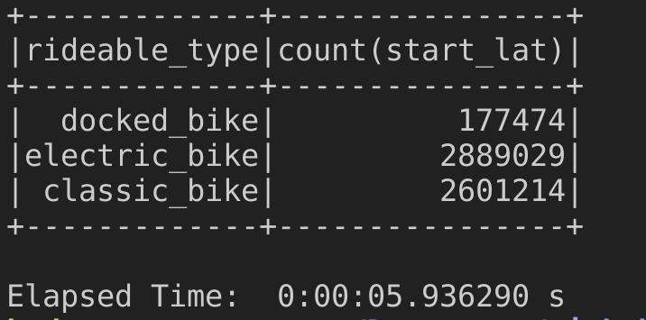
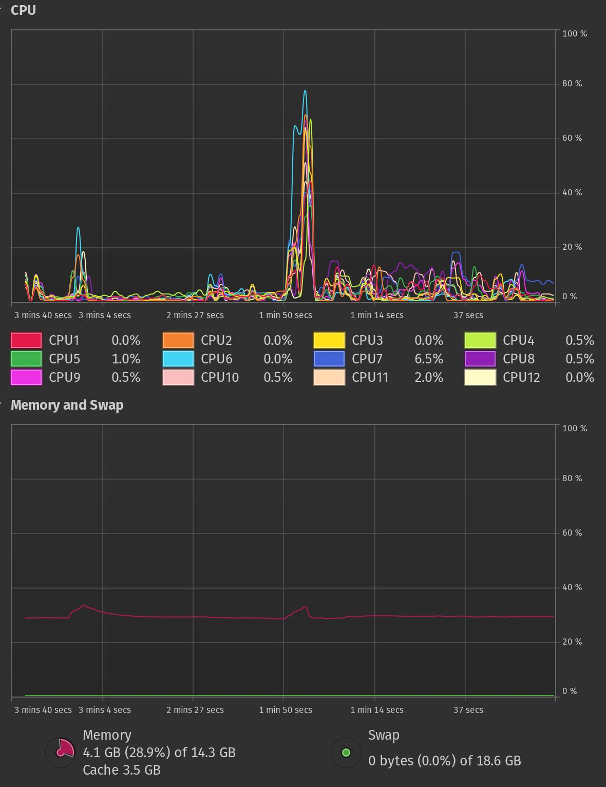
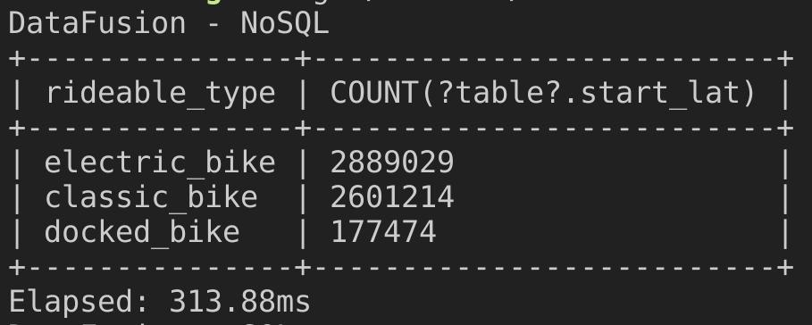
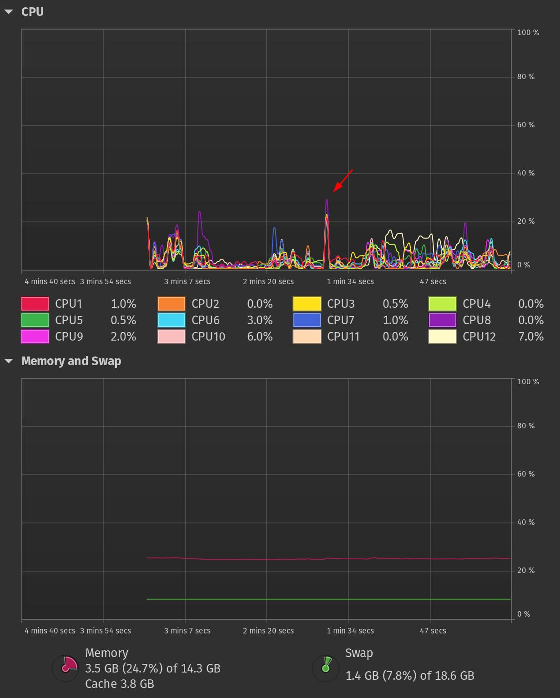
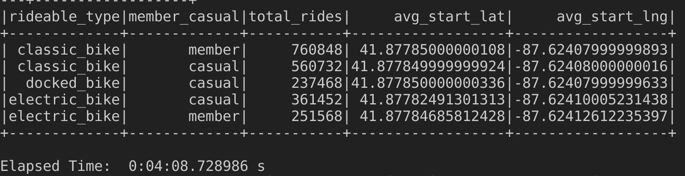
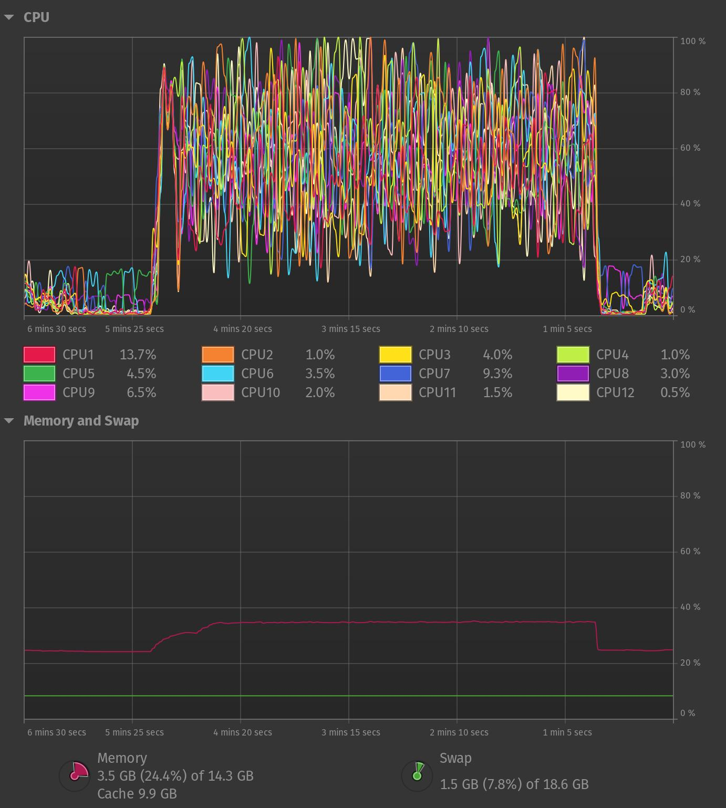
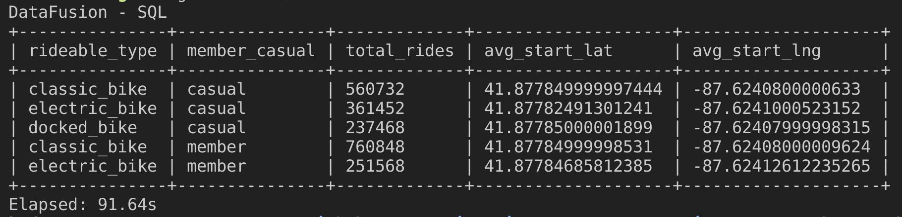
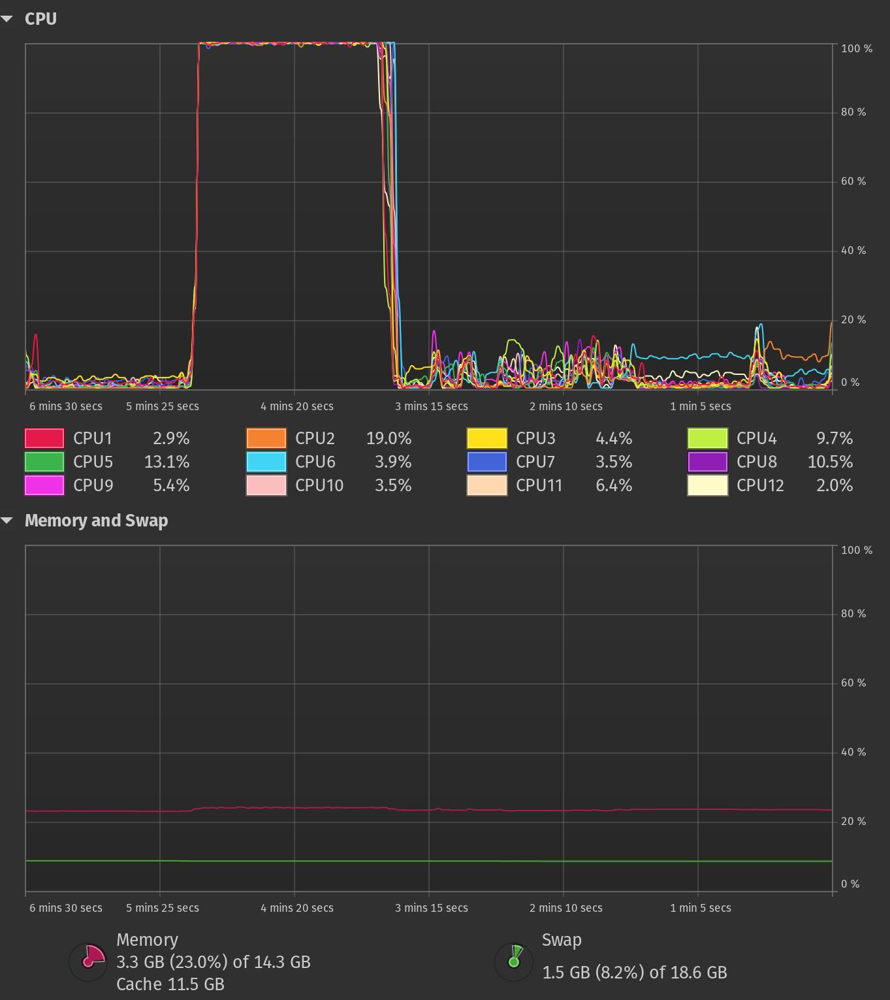

### Rust Datafusion vs PySpark: 10 billions rows performance comparison
Can Rust's DataFusion challenge Spark's dominance in data engineering? DataFusion's recent performance improvements are intriguing.

#### Datafusion & Spark
DataFusion ([docs](https://arrow.apache.org/datafusion/user-guide/introduction.html)) is a fast query engine for Rust that uses Apache Arrow for speedy data analysis. It supports common data formats and offers customization for specific needs, with a strong community for support.

Apache Spark ([docs](https://spark.apache.org/docs/latest/)): Open-source big data engine for handling massive datasets across clusters, making it a popular choice.

##### Comparison table
Feature | Apache DataFusion | Apache Spark |
--- | --- | --- |
Processing Model | Single-node, in-memory | Distributed, in-memory and out-of-memory |
Language | Rust | Scala (primary), Java, Python, R |
Scalability | Limited but on roadmap (can be distributed with Ballista) | Highly scalable |
Supported Data Sources | CSV, Parquet, AVRO, JSON | Wide variety including CSV, Parquet, JSON, JDBC, and more |
Performance | Faster? | Slower? |
Ease of Use | Simpler API, easier to learn | More complex API with a larger learning curve |
Ecosystem | Smaller, growing ecosystem | Large, mature ecosystem with a wide range of libraries and tools
Maturity | Relatively new project (~5 years)| Established and widely used |
Use Cases | Large scale analytics, prototyping, embedded analytics | Large-scale data processing, machine learning, real-time analytics |


### So... Which is faster using 1.1 GB dataset?
##### System:
AMD® Ryzen 5 6600hs creator edition × 12
16.0 GiB
Pop!_OS 22.04 LTS


##### Dataset: [ciclistic-trip-data](https://www.kaggle.com/datasets/chihchungwuo/cyclistic-trip-data) (12 csv files, 19 - 153 MB each, total 1.1 GB)


#### Test 1: Group by & count with functions
Find out how many cyclists are in each class.

###### PySpark
Counting bikes by type took almost 6 seconds for PySpark.

<div align="center">
  
</div>

<div align="center">
  
</div>


###### Datafusion
This process achieved a 19x speedup over PySpark, completing in just 313 milliseconds.

<div align="center">
  
</div>

<div align="center">
  
</div>

### ok... Multiply our dataset up to 10 billion rows!
Multiplying the main dataset by 350 times resulted in 4200 files with a total size of 192 GB.

#### Test 2: Group by, filter, calculations using SQL (10 bill rows)
Let's measure performance using SQL.

Query:
```
select 
  rideable_type,
  member_casual,
  count(ride_id) as total_rides,
  avg(start_lat) as avg_start_lat,
  avg(start_lng) as avg_start_lng
from rides
where start_station_name = 'Michigan Ave & Jackson Blvd'
group by rideable_type, member_casual
```

###### PySpark
PySpark finished the challenge in 4 minutes and 8 seconds.
<div align="center">
  
</div>

<div align="center">
  
</div>

###### Datafusion
Completed it in 1 minute and 31 seconds, again outperforming PySpark by 2.7 times.

<div align="center">
  
</div>

<div align="center">
  
</div>

#### So... Old guard vs. rising star?

Remember the DataFusion vs. PySpark showdowns from last year? Spark, the industry giant, reigned supreme with its vast integrations and legacy status. Cloud giants like AWS and GCP even embraced it with open arms (think EMR and Dataproc).

But fast forward to today and the situation is different. DataFusion's been on a tear, making it a strong contender for projects prioritizing performance, cost efficiency and rock-solid stability.

- The Rust ecosystem is growing (1.77% of all GitHub code!) and it offers a complete data engineering toolkit.
- DataFusion delivers blazing-fast query execution, making it a dream for performance-hungry geeks.
- Compared to Spark's bulkiness, DataFusion is a lightweight champ, keeping your costs in check.

So... ninjas! Depends on project, but if you're looking for a modern, lightweight, high-performance query engine and don't need real time streaming then DataFusion should be on your list.