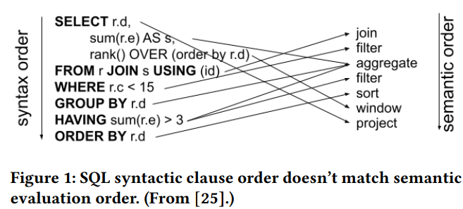
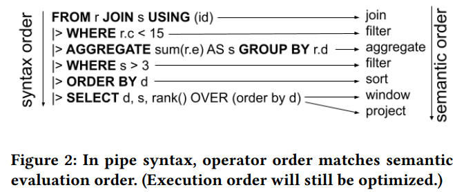

### Google reinventing SQL

SQL, a 50-year-old language, is essential for database management. While its power is undeniable, its complex syntax can be challenging. Google is developing a simplified SQL approach for improved user experience.

### Traditional SQL, while powerful, has several key disadvantages:

1. *Unintuitive syntax:* The order of clauses (SELECT, FROM, WHERE) doesn't match the logical flow of data processing, making it harder for beginners to understand.

2. *Verbosity:* Complex queries can become long and difficult to read, especially with multiple joins and subqueries.

3. *Steep learning curve:* The syntax and structure of SQL can be intimidating for newcomers, particularly those from non-technical backgrounds.

4. *Limited expressiveness:* Some operations that are simple in procedural languages can be cumbersome to express in SQL.

5. *Readability issues:* As queries grow in complexity, they become harder to read and maintain, especially in collaborative environments.

These limitations have led to various attempts to improve or reinvent SQL.

### Standart SQL examples:
example and logic:

```
SELECT product_name, AVG(price) as avg_price, SUM(quantity_sold) as total_sold
FROM sales_table
JOIN product_table ON sales_table.product_id = product_table.id
WHERE sale_date BETWEEN '2023-01-01' AND '2023-12-31'
AND category = 'Electronics'
GROUP BY product_name
HAVING total_sold > 100
ORDER BY avg_price DESC
```




This structure can be hard to follow because the `SELECT` clause depends on the `FROM` clause, which actually comes later in the query. Logically, we think about data in a different order: we first decide where the data is coming from (`FROM`), then we filter it (`WHERE`), and finally, we decide what to retrieve (`SELECT`). This reverse order can be confusing, especially for beginners.
Google’s New Approach: The Pipe Syntax
To make SQL more user-friendly, Google’s researchers have introduced a new syntax that uses a "pipe operator" (`|>`). This operator lets you build queries in a way that follows the natural flow of thought. Here’s what the earlier query would look like with Google’s new syntax:

Google's sql approach and logic:

```
FROM sales_table
|> JOIN product_table ON sales_table.product_id = product_table.id
|> WHERE sale_date BETWEEN '2023-01-01' AND '2023-12-31' AND category = 'Electronics'
|> AGGREGATE product_name, AVG(price) AS avg_price, SUM(quantity_sold) AS total_sold
GROUP BY product_name
|> HAVING total_sold > 100
|> ORDER BY avg_price DESC
```



This version starts with `FROM` and uses the pipe operator (`|>`) to connect each step, making the query flow more naturally and easier to understand.

### Why it is better?
1. Improved Readability: The pipe syntax follows a more natural, top-to-bottom flow of logic, making queries easier to understand.

2. Logical Order: It aligns with how we typically think about data processing, starting with the data source and ending with the desired output.

3. Modularity: The pipe operator (`|>`) clearly separates each step of the query, making it easier to modify or debug individual parts.

4. Easier for Beginners: The intuitive structure makes SQL more approachable for newcomers and those familiar with modern data analysis tools.

5. Better for Complex Queries: As queries become more intricate, the pipe syntax maintains clarity and readability.

Overall, Google's approach simplifies SQL writing and comprehension, potentially making data analysis more accessible and efficient.

### Conclusion
Google's innovative SQL syntax aims to simplify the language, especially for beginners, by streamlining query structures. However, its adoption as the industry standard remains uncertain, depending on acceptance by the broader SQL community and major database systems. Opinions about this new SQL dialect vary widely within the database community, with some praising its intuitive approach while others express concerns about potential complexity and deviation from established conventions. This debate underscores the ongoing evolution of database query languages.

#### References
##### Google paper: [Link](https://storage.googleapis.com/gweb-research2023-media/pubtools/1004848.pdf)
##### Simons Wilson weblog: [Link](https://simonwillison.net/2024/Aug/24/pipe-syntax-in-sql/)