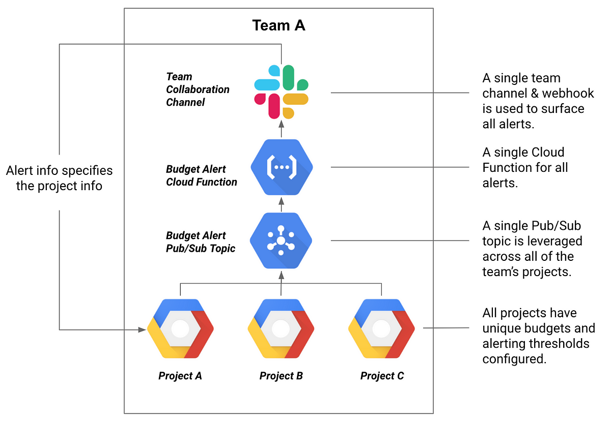
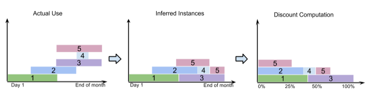

# GCP Costs Optimization Techniques and best practices

##### 1. Implement budgets and alerts
   Best practices for implementing budgets and alerts:
   - Start with a conservative budget based on historical usage patterns
   - Set up multiple budget thresholds (50%, 75%, 90%, 100%) for early warnings
   - Configure alerts to notify both billing admins and project owners
   - Create separate budgets for each major project/department
   - Use labels consistently to track costs by application/environment
   - Review and adjust budgets quarterly based on actual spend
   - Enable programmatic notifications (e.g. Cloud Functions) for automated responses
   - Document budget allocation decisions and alert configurations
   - Set up dashboards to visualize spend against budgets
   - Consider seasonal variations when setting budget amounts

   
   *Image source: [Medium article](https://medium.com/google-cloud/how-to-set-up-budget-alerts-in-google-cloud-platform-gcp-94128044834f)*
   
   *Figure 1: GCP Billing Budget Alert Configuration example for Slack notifications*

   [Google Cloud Billing documentation](https://cloud.google.com/billing/docs/how-to/budgets)

   *Potential savings: 10-20%* through better cost awareness and proactive management

##### 2. Set up quotas and limits
   - Best practices:
     - Regularly monitor quota usage
     - Plan ahead for quota increases (takes 2-3 business days)
     - Set up alerts for quota thresholds
     - Consider quotas during application design
     - Document quota requirements for your projects

   [Google Cloud Quotas documentation](https://cloud.google.com/compute/quotas-limits)

   *Potential savings: 5-15%* by preventing unexpected resource usage spikes

##### 3. Utilize preemptible instances & spot instances
   - Best practices:
     - Use for fault-tolerant, stateless workloads
     - Design applications to handle interruptions
     - Save work frequently and checkpoint data
     - Use managed instance groups for automatic recreation
     - Monitor preemption notices (30 second warning)

   [Google Cloud Preemptible VMs documentation](https://cloud.google.com/compute/docs/instances/preemptible)
   [Google Cloud Spot VMs documentation](https://cloud.google.com/compute/docs/instances/spot)

   *Potential savings: 60-90%* compared to regular instance pricing
   - Spot VMs can save up to 91% compared to regular instances
   - Preemptible VMs typically save 60-80%

##### 4. Leverage committed usage discounts (CUD)
   - Best practices:
     - Analyze usage patterns before committing
     - Start with 1-year commitments to evaluate
     - Consider mix of CUD and on-demand for flexibility
     - Monitor commitment utilization
     - Use spend-based for varying workloads

   [Google Cloud CUD documentation](https://cloud.google.com/compute/docs/instances/signing-up-committed-use-discounts)

   *Potential savings: 20-57%* depending on commitment term
   - 1-year commitment: up to 37% discount
   - 3-year commitment: up to 57% discount

##### 5. Optimize with sustained use discounts
   - Best practices:
     - Analyze usage patterns before committing
     - Start with 1-year commitments to evaluate
     - Consider mix of CUD and on-demand for flexibility
     - Monitor commitment utilization
     - Use spend-based for varying workloads

   [Google Cloud SUD documentation](https://cloud.google.com/compute/docs/sustained-use-discounts)
   
   *Figure 2: Sustained use discounts example*

   *Potential savings: up to 30%* automatically applied for consistent usage
   - Discounts start at 20% and increase to 30% for full-month usage

##### 6. Configure billing & export
   - Best practices:
     - Use Cloud Billing API for programmatic access
     - Export data to BigQuery for analysis
     - Set up alerts and dashboards in BigQuery
     - Use Cloud Billing export to S3 for long-term storage

   [Google Cloud Billing Export documentation](https://cloud.google.com/billing/docs/how-to/export-data-bigquery)

   *Potential savings: 5-15%* through better visibility and analysis

##### 7. Implement organization policies
   - Best practices:
     - Use organization policies to manage resource settings
     - Set policies for projects, folders, and billing accounts
     - Use policies to enforce settings like region, service restrictions, etc.
     - Review policies regularly to ensure compliance

   [Google Cloud Organization Policies documentation](https://cloud.google.com/resource-manager/docs/organization-policy/overview)

   *Potential savings: 10-20%* through better resource governance

##### 8. Schedule VM instances
   - Best practices:
     - Use Cloud Scheduler to trigger VM start/stop
     - Cloud Functions to handle VM management logic
     - Set up triggers based on time, API activity, or other events
     - Monitor execution logs and errors
     - Ensure functions have appropriate permissions

   [Google Cloud Cloud Scheduler documentation](https://cloud.google.com/scheduler/docs/start-and-stop-compute-engine-instances-on-a-schedule)

   *Potential savings: 45-65%* for non-production environments
   - Example: Shutting down dev/test instances during nights/weekends

##### 9. Configure lifecycle policies in Google Cloud Storage
   - Best practices:
      - use lifecycle policy to manage objects
      - set policies for different storage classes
      - consider storage class for different types of data
      - review policies regularly to ensure compliance

   [Google Cloud Life Cycle Policy documentation](https://cloud.google.com/storage/docs/lifecycle)

   *Potential savings: 20-50%* on storage costs
   - Archive storage: up to 60% cheaper than standard storage
   - Coldline storage: up to 50% cheaper than standard storage

##### 10. Monitor and remove unused disks and IP addresses
   - Best practices:
      - use gcloud command to identify unused disks
      - set up alerts for unused resources
      - consider automation for periodic checks
      - review unused resources regularly

   [Google Cloud gcloud command documentation](https://cloud.google.com/compute/docs/viewing-and-applying-idle-resources-recommendations)

   *Potential savings: 5-15%* by eliminating waste
   - Unused static IPs cost ~$3/month each

##### 11. Configure custom virtual machine instances
   - Best practices:
      - use custom machine types for specific workloads
      - consider vCPU and memory requirements
      - review machine types regularly
      - use Shielded VMs for enhanced security

   [Google Cloud Custom Machine Types documentation](https://cloud.google.com/compute/docs/instances/creating-instance-with-custom-machine-type)

   *Potential savings: 10-30%* by right-sizing instances

##### 12. Prevent duplicated data in GCS buckets
   - Best practices:
      - use naming conventions to avoid duplicates
      - consider versioning for important data
      - review bucket usage regularly

   *Potential savings: 5-20%* on storage costs

##### 13. Optimize region selection for costs and performance
   - Best practices:
      - choose regions based on data residency, performance, and compliance requirements
      - consider regional vs multi-regional options
      - use Cloud Console or gcloud to check service availability
      - review region-specific costs and performance characteristics

   [Google Cloud Region Selection documentation](https://cloud.google.com/solutions/best-practices-compute-engine-region-selection)

   *Potential savings: 10-40%* depending on region choice
   - Some regions can be 20-40% cheaper than others

##### 14. Optimize BigQuery performance and costs
   - Best practices:
      - avoid select *, 
      - use caching, 
      - turn on history based optimization feature
      - expiration for tables, views
      - use of partitions
      - use of clustering
      - flex slots and pricing
      - delete vs truncate
      - limit query number of bytes processed per query

   [Google Cloud Bigquery documentation](https://cloud.google.com/bigquery/docs/best-practices-performance-overview)

   *Potential savings: 40-60%* on query costs
   - Partitioning can reduce queried data by 50-80%
   - Clustering can reduce queried data by 30-60%

##### 15. Choose between on-demand vs provisioned capacity
   - Best practices:
      - use on-demand for flexible workloads
      - consider provisioned capacity for predictable workloads
      - use Cloud Console or gcloud to check pricing and availability
      - review capacity options regularly

   [Article about on demand vs provision capacity](https://www.cloudzero.com/blog/on-demand-vs-spot-instances/)

   *Potential savings: 15-30%* through optimal capacity planning

##### 16. Manage egress pricing
   - Best practices:
      - understand egress pricing model
      - use caching to reduce egress costs
      - consider regional vs multi-regional storage
      - use Cloud Console or gcloud to check egress costs
      - review egress usage and costs regularly

   [Google Cloud Egress Pricing documentation](https://cloud.google.com/vpc/network-pricing)

   *Potential savings: 20-50%* on network costs
   - Using CDN can reduce egress costs by 40-60%

##### 17. Monitor resource utilization
   - Best practices:
      - use Cloud Monitoring to track resource utilization
      - set up alerts for high resource usage
      - consider using Stackdriver for advanced monitoring
      - review monitoring data regularly

   *Potential savings: 10-25%* through better resource management

##### 18. Leverage Cloud Shell for development
   - Best practices:
      - use Cloud Shell for quick access to GCP resources
      - use Cloud Shell for development tasks
      - consider using Cloud Shell for interactive sessions
      - review Cloud Shell usage and costs regularly

   *Potential savings: 5-10%* on development infrastructure

##### 19. Plan service availability across regions
   - Best practices:
      - understand availability options for different services
      - consider regional vs zonal services
      - use Cloud Console or gcloud to check service availability
      - review service availability and costs regularly

   *Potential savings: 10-30%* through optimal region selection

##### 20. Choose optimal disk types
   - Best practices:
      - consider HHD for cost-sensitive workloads
      - use SSD for high-performance, low-latency workloads
      - review disk types and costs regularly

   [Google Cloud Disk Types documentation](https://cloud.google.com/compute/docs/disks)

   *Potential savings: 20-50%* on storage costs
   - Standard HDD is ~60% cheaper than SSD

##### 21. Utilize GCP Recommendations for cost optimization
   - Best practices:
      - use GCP Recommendations for cost optimization
      - consider using Cloud Console or gcloud to check recommendations
      - review recommendations regularly

   [Google Cloud Recommendations documentation](https://cloud.google.com/recommendations)

   *Potential savings: 10-35%* by following automated recommendations

##### 22. Automate Dataproc cluster scheduling
   - Best practices:
      - use Cloud Scheduler to trigger Dataproc cluster
      - Cloud Functions to handle Dataproc cluster management logic
      - set up triggers based on time, API activity, or other events
      - monitor execution logs and errors
      - ensure functions have appropriate permissions

   [Google Cloud Cloud Scheduler documentation](https://cloud.google.com/dataproc/docs/tutorials/workflow-scheduler)

   *Potential savings: 40-60%* on Dataproc costs
   - Shutting down clusters when not in use