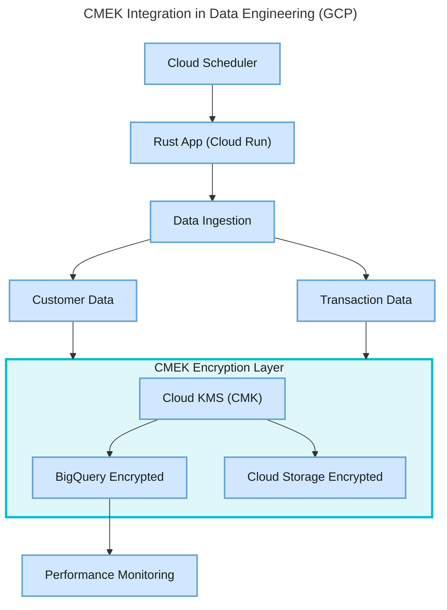

```mermaid
---
title: CMEK Integration in Data Engineering (GCP)
---
flowchart TD
    A["Cloud Scheduler"] --> B["Rust App (Cloud Run)"]
    
    B --> C["Data Ingestion"]
    
    C --> D["Customer Data"]
    C --> E["Transaction Data"]
    
    subgraph SECURITY["CMEK Encryption Layer"]
        F["Cloud KMS (CMK)"]
        G["BigQuery Encrypted"]
        H["Cloud Storage Encrypted"]
        
        F --> G
        F --> H
    end
    
    D --> SECURITY
    E --> SECURITY
    
    G --> I["Performance Monitoring"]

    style A fill:#D0E7FF,stroke:#66A3D2,stroke-width:2px,color:#1C1C1C
    style B fill:#D0E7FF,stroke:#66A3D2,stroke-width:2px,color:#1C1C1C
    style C fill:#D0E7FF,stroke:#66A3D2,stroke-width:2px,color:#1C1C1C
    style D fill:#D0E7FF,stroke:#66A3D2,stroke-width:2px,color:#1C1C1C
    style E fill:#D0E7FF,stroke:#66A3D2,stroke-width:2px,color:#1C1C1C
    style F fill:#D0E7FF,stroke:#66A3D2,stroke-width:2px,color:#1C1C1C
    style G fill:#D0E7FF,stroke:#66A3D2,stroke-width:2px,color:#1C1C1C
    style H fill:#D0E7FF,stroke:#66A3D2,stroke-width:2px,color:#1C1C1C
    style E fill:#D0E7FF,stroke:#66A3D2,stroke-width:2px,color:#1C1C1C
    style I fill:#D0E7FF,stroke:#66A3D2,stroke-width:2px,color:#1C1C1C
    style SECURITY fill:#E0F7FA,stroke:#00BCD4,stroke-width:3px,color:#1C1C1C
```

[github.com/Kodotautas](https://github.com/Kodotautas)
    
```