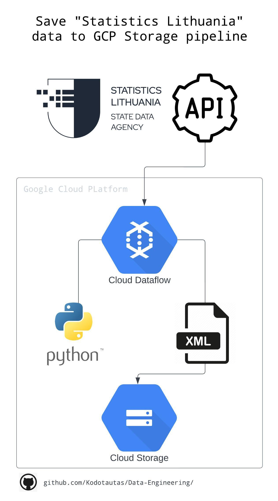

# This project is about creating Lithuania market statistics pipeline with GCP Dataflow.

# About pipeline:
- parse all valid ids for data from Lithuania Statistics department
- filter out which are not updatable any more and leave later than 2022-01-01
- from Lithuania Statistics via API download all data
- stores .xml files in GCS Buckets by data group for futher use cases
- final Dataflow pipeline updates once per month only newly updated LT statistics

# API source / info:
https://osp.stat.gov.lt/web/guest/rdb-rest

## Install apache beam GCP:
`pip install apache_beam[gcp]`

# Dataflow:
### To create template:
`python3 main.py --setup_file ./setup.py --region europe-west1 --output gs://lithuania_statistics/output --runner DataflowRunner --project vl-data-learn --months 1 --staging_location gs://vl-data-learn/dataflow/staging --temp_location  gs://lithuania_statistics/temp/ --template_location gs://lithuania_statistics/templates/lt-statistics-template`

## Run with CLI:
`python3 main.py --setup_file ./setup.py --region europe-west1 --output gs://lithuania_statistics/output --runner DataflowRunner --project vl-data-learn --staging_location gs://vl-data-learn/dataflow/staging --temp_location  gs://lithuania_statistics/temp/ --months 1`

`--months` argument set how many month look back and send that ID's

### Pipeline diagram:
