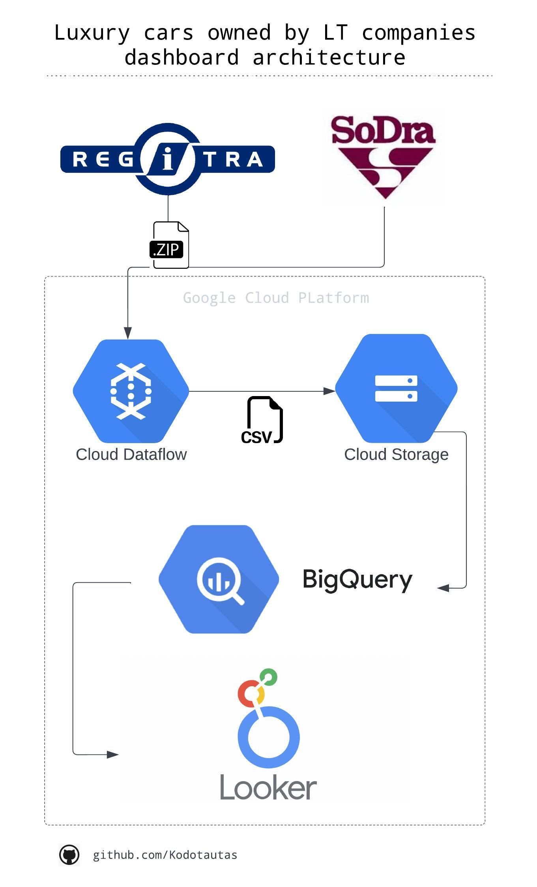

### This project is dashboard focusing on Lithuanian companies, individuals transport. The whole project constructed using Google Cloud Platform tools such as Dataflow, Storage, BigQuery, and Looker Studio.

### About pipeline:
- get information about companies cars from Regitra
- get information about companies and it's names
- store data in BigQuery
- analyze companies and create dashboard with Looker Studio
- set schedule to pipeline and dashboard

### Dataflow:
#### Create template:
`python3 main.py --setup_file ./setup.py --region europe-west1 --output gs://lithuania_statistics/output --runner DataflowRunner --project vl-data-learn --staging_location gs://vl-data-learn/dataflow/staging --worker_machine_type=e2-standard-2 --temp_location  gs://lithuania_statistics/temp/ --template_location gs://lithuania_statistics/templates/lt-cars-dashboard-template-10`

### Run:
`python3 main.py --setup_file ./setup.py --region europe-west1 --output gs://lithuania_statistics/output --runner DataflowRunner --project vl-data-learn --staging_location gs://vl-data-learn/dataflow/staging --temp_location  gs://lithuania_statistics/temp/ --worker_machine_type=e2-standard-2`

### Architecture:

  

##### Dashboard link: [Here](https://lookerstudio.google.com/s/uMGgaIay7bA)
