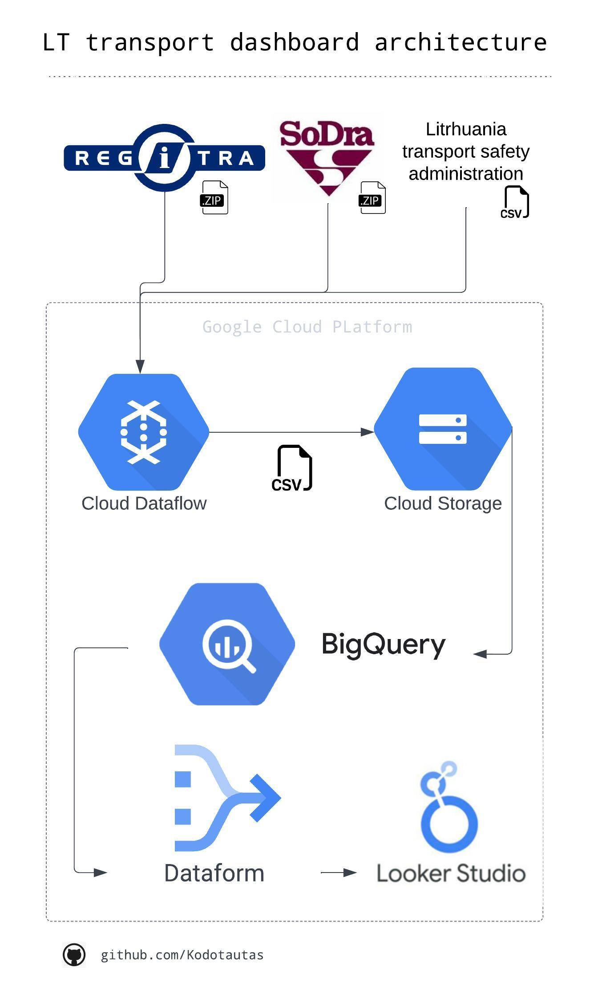

### This project is about to create dashboard about Lithuania companies which own luxury cars, build using GCP (Dataflow, Storage, Bigquery, Looker)

### About pipeline:
- get information about companies cars from Regitra
- get information about companies and it's names
- store data in BigQuery
- analyze companies and create dashboard with Looker
- set schedule to pipeline and dashboard

### Dataflow:
#### Create template:
`python3 main.py --setup_file ./setup.py --region europe-west1 --output gs://lithuania_statistics/output --runner DataflowRunner --project vl-data-learn --staging_location gs://vl-data-learn/dataflow/staging --worker_machine_type=e2-standard-2 --temp_location  gs://lithuania_statistics/temp/ --template_location gs://lithuania_statistics/templates/lt-cars-dashboard-template-7`

### Run:
`python3 main.py --setup_file ./setup.py --region europe-west1 --output gs://lithuania_statistics/output --runner DataflowRunner --project vl-data-learn --staging_location gs://vl-data-learn/dataflow/staging --temp_location  gs://lithuania_statistics/temp/ --worker_machine_type=e2-standard-2`

### Architecture:

##### Dashboard link: [Here](https://lookerstudio.google.com/s/uMGgaIay7bA)

- what add more to dashboard?
- ships
- connect JADIS(?) to get sales revenue
- where get electric cars / fuel type data because rigitra is bad

- set powerful cars >= 300 kW (set before launching)
- inform about technical & fundamental changes in last Friday of the month 

- transport meters data