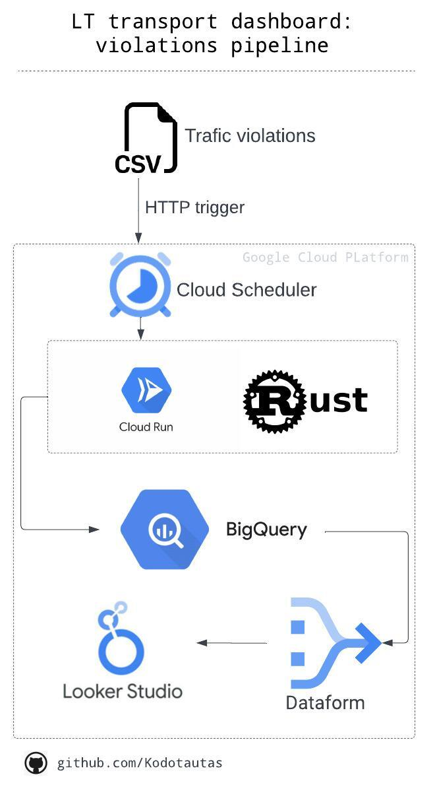

### Part of pipeline with Rust to get traffic violations for LT transport dashboard
Pipeline for Lithuanian traffic violations data to be added to the LT Transport dashboard for learning and bonding with Rust in Data Engineering.

### Architecture:

  

