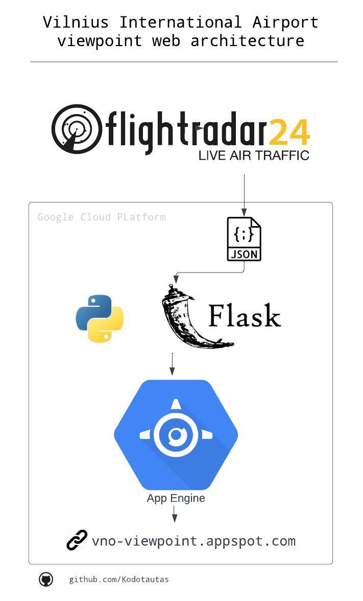

#### Overview
Vilnius International Airport viewpoint web app to find the best time to watch planes.

Created out of a personal passion for plane-watching with my son in Vilnius International Airport viewpoint ([Maps location](https://maps.app.goo.gl/PTA66kc9aR2LAeks8)), project offering real-time flight data. Leveraging FlightRadar24 ([unoficial API](https://github.com/JeanExtreme002/FlightRadarAPI)), the application is deployed on GCP App Engine, powered by Python and Flask.

#### Key Features
- `Time Grouping & Vizualization`: categorizes flights into 10-minute intervals for easy comprehension of flight distribution over time and vizualize number of counts.

- `Detailed VNO Flights Table`: Access a comprehensive table dedicated to VNO flights.

- `Real-time Data Updates`: Stay current with the latest flight data by refreshing the page.

#### Architecture

  

#### Access the Web Application
[Here](https://vno-viewpoint.appspot.com/) 
For inquiries or feedback, feel free to reach out. Happy plane spotting in Vilnius!
