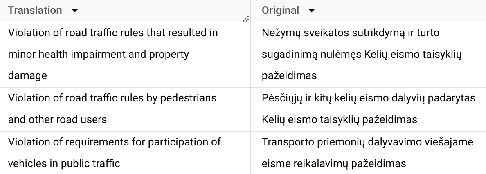
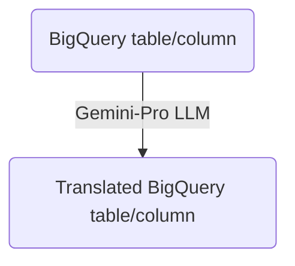

How to use The Gemini-Pro LLM model in BigQuery as text Translator? 🌍

BigQuery (GCP's data warehouse) lets you analyze data and run machine learning models, including large language models like me (powered by Vertex AI). There is a way to use LLM's as translator.

##### STEPS


Step 1: Create a BigQuery dataset: [docs](https://cloud.google.com/bigquery/docs/generate-text-tutorial#create_a_dataset)

Step 2: Create a Vertex AI connection: [docs](https://cloud.google.com/bigquery/docs/generate-text-tutorial#create_a_connection)

Step 3: Create model:
```
CREATE OR REPLACE MODEL `vl-data-learn.vertex-ai`
REMOTE WITH CONNECTION `eu.vertex-connection`
OPTIONS (ENDPOINT = 'gemini-pro')
```

Where:
`vl-data-learn` - dataset
`vertex-ai` - model name
`eu.vertex-connection` - region & connection name

For the purpose of test Gemini as translator I used Lithuania traffic violations dataset where need translate laws names to english.

Step 4. Query example to translate column from Lithuanian to English.
```
SELECT 
  STRING(ml_translate_result.translations[0].translated_text) AS Translation,
  text_content as Original
FROM
(
  SELECT * FROM ML.TRANSLATE(
  MODEL `raw_data.vertex-ai`,
  (SELECT ank_straipsnis_pav AS text_content from raw_data.road_violations limit 20),
  STRUCT('translate_text' AS translate_mode, 'en' AS target_language_code))
)
```

Output example:
<div align="center">
  
</div>


Flow:

